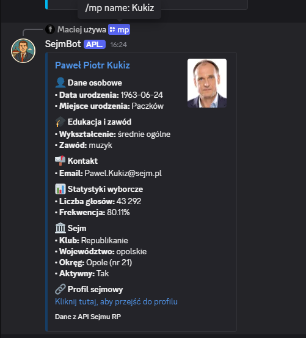
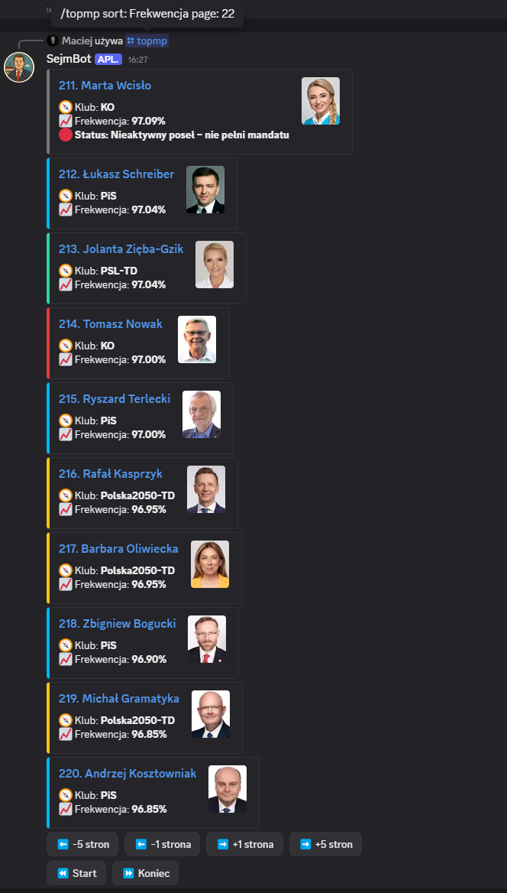
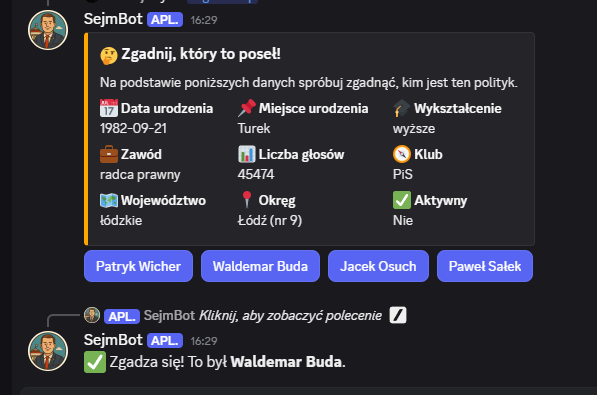
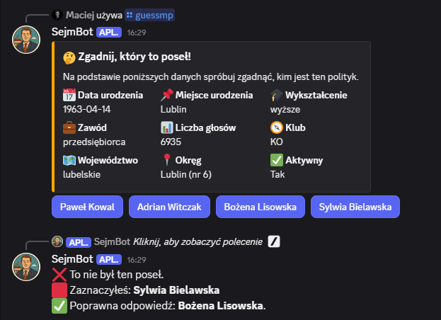

# 🇵🇱 Sejmbot – Discord Bot for the Polish Parliament

> ⚠️ **Warning: Pre-Release Version**  
> This project is currently in active development and considered a **pre-release**.  
> Some features may be incomplete, unstable, or missing altogether.  
> Please report bugs or suggestions via [GitHub Issues](https://github.com/MaciejMi/sejmbot/issues).

**Sejmbot** is a Discord bot that displays information about Members of the Polish Parliament (Sejm, 10th term), including attendance and voting statistics. It provides a paginated, interactive ranking system directly within Discord.


## 🧠 Features

- Three main slash commands:
  - `/mp <first-name last-name>` or `/mp <last-name first-name>` – shows info about a specific MP.  
    You can also search by just:
    - first name (e.g. `Anna`)
    - last name (e.g. `Kowalski`)  
      If the input is ambiguous (e.g. common names), the bot will return a list of possible matches. You must then refine the search using the full name or a more unique part of the surname.
  - `/guessmp` – a guessing game where you're shown a random MP's stats and must guess the correct one out of 4 MPs from the same political club.
  - `/topmp` – a ranking of MPs, with optional parameters:
    - `sort`: by `Frekwencja` (attendance) or `Głosy` (number of votes)
    - `page`: display a specific page of the ranking
- Interactive pagination with buttons (next/prev, +5/-5, first/last)
- Data fetched from the official Sejm API:
  - `https://api.sejm.gov.pl/sejm/term10/MP`
- Embed messages color-coded by political club

---

## 🛠️ Technologies Used

- **Node.js** (v18+)
- **discord.js** (v14+)
- Public data from: **https://api.sejm.gov.pl**

---

## 📦 Installation

1. Clone the repository:

```bash
git clone https://github.com/MaciejMi/sejmbot.git
cd sejmbot
```

2. Install dependencies:

```bash
npm install
```

3. Create `config.json`:

```json
{
	"token": "YOUR_DISCORD_BOT_TOKEN",
	"guildId": "YOUR_DISCORD_SERVER_ID",
	"clientId": "YOUR_DISCORD_BOT_CLIENT_ID"
}
```

4. (Optional) Change party colors in `data/partyColours.json`:

```json
{
	"KO": "#DD3E3B",
	"Konfederacja": "#376ACB",
	"Konfederacja_KP": "#192D5E",
	"Lewica": "#9038B3",
	"niez.": "#ffffff",
	"PiS": "#00B8EE",
	"Polska2050-TD": "#F8C21A",
	"PSL-TD": "#2ED397",
	"Razem": "#AD2178",
	"Republikanie": "#163D64",
	"Nieaktywny": "#777777"
}
```

---

## ▶️ Running the Bot

```bash
node main.js
```

### ℹ️ If you added a new command under commands/YOUR_FOLDER/, make sure to register it first by running:

```bash
node deploy-commands.js
```

## 🧪 Example Usage

### `/topmp` (MP ranking)

Displays a ranking of MPs. You can sort by:

- `Głosy` (votes) (default)
- `Frekwencja` (attendance rate)

You can also choose which page to display:

```
/topmp sort:Frekwencja page:2
```

### `/mp`

Examples:

- `/mp Kowalski`
- `/mp Anna`
- `/mp Anna Kowalska`
- `/mp Kowalska Anna`
- `/mp Kowal An`
- `/mp Ann Kow`  
  If multiple MPs match, you'll be asked to specify the name more clearly.

---

## 🗂 Project Structure

```
.
├── commands/
│   └── politics/
│       └── topmp.js         # slash command for MP ranking
│       └── mp.js            # search MP by name
│       └── guessmp.js       # MP guessing game
├── events/                  # Discord event handlers (e.g., ready)
├── data/
│   └── partyColours.json    # political club color mapping
├── config.json              # bot token
├── main.js                  # entry point
├── package.json
└── README.md
```

---

## 🖥️ Screens

### Użycie komendy `/mp Kukiz`:



### Użycie komendy `/topmp sort: Frekwencja page: 22`:



### Użycie komendy `/guessmp`:





---

## 📋 Roadmap Ideas

- `/mandates` – show current Sejm party composition
- Notifications for new votes or MP changes
- Support for Sejm term selection,
- And a lot of other ideas... 🚀

---

## 📄 License

This project is open-source and licensed under the MIT License.

You are free to fork, modify, and use this bot for local or private non-commercial purposes.
Public forks are allowed, but must clearly credit the original author (MaciejMi).
Commercial use and publishing the bot as your own (e.g. on public bot lists) without permission is strictly prohibited.
